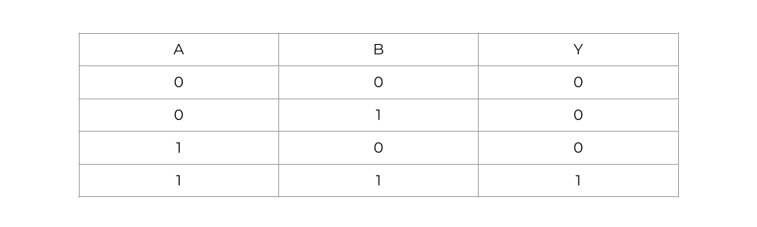

# UTCTF - A Bit Weird

**Category:** Crypto<br/>
**Points:** 986/1000<br/>
**Solves:** 39<br/>

&nbsp;

> I found this weird RSA looking thing somewhere. Can you
> break it for me? I managed to find x for you, but I don't know
> how to solve it without d...

&nbsp;

*Writeup By:* [gov](https://github.com/rgovind92)

&nbsp;

## TLDR
Use Coppersmith's method to recover the MSBs, then use the AND/OR truth tables to recover the rest of the bits.

&nbsp;

## The Challenge
We're given the source code for what looks to be textbook RSA, and the program's output:

```
from Crypto.Util import number
from secret import flag
import os

length = 2048
p, q = number.getPrime(length // 2), number.getPrime(length // 2)
N = p * q
e = 3

m = number.bytes_to_long(flag)
x = number.bytes_to_long(os.urandom(length // 8))

c = pow(m | x, e, N)
print("N =", N)
print("e =", e)
print("c =", c)
print("m&x =", m & x)
```

```
N = 13876129555781460073002089038351520612247655754841714940325194761154811715694900213267064079029042442997358889794972854389557630367771777876508793474170741947269348292776484727853353467216624504502363412563718921205109890927597601496686803975210884730367005708579251258930365320553408690272909557812147058458101934416094961654819292033675534518433169541534918719715858981571188058387655828559632455020249603990658414972550914448303438265789951615868454921813881331283621117678174520240951067354671343645161030847894042795249824975975123293970250188757622530156083354425897120362794296499989540418235408089516991225649
e = 3
c = 6581985633799906892057438125576915919729685289065773835188688336898671475090397283236146369846971577536055404744552000913009436345090659234890289251210725630126240983696894267667325908895755610921151796076651419491871249815427670907081328324660532079703528042745484899868019846050803531065674821086527587813490634542863407667629281865859168224431930971680966013847327545587494254199639534463557869211251870726331441006052480498353072578366929904335644501242811360758566122007864009155945266316460389696089058959764212987491632905588143831831973272715981653196928234595155023233235134284082645872266135170511490429493
m&x = 947571396785487533546146461810836349016633316292485079213681708490477178328756478620234135446017364353903883460574081324427546739724

x = 15581107453382746363421172426030468550126181195076252322042322859748260918197659408344673747013982937921433767135271108413165955808652424700637809308565928462367274272294975755415573706749109706624868830430686443947948537923430882747239965780990192617072654390726447304728671150888061906213977961981340995242772304458476566590730032592047868074968609272272687908019911741096824092090512588043445300077973100189180460193467125092550001098696240395535375456357081981657552860000358049631730893603020057137233513015505547751597823505590900290756694837641762534009330797696018713622218806608741753325137365900124739257740
```

&nbsp;

## The Wrong Approach

This is something I tried that didn't work, so feel free to skip to the next section for the solution. My first question was: Given a number _a_ and the number _a & b_, where _b_ is an unknown number, how many bits of _b_ can we recover? Recall the AND truth table:



There are two cases in which _B_ can be recovered: If _Y_ is 1 (then both _A_ and _B_ have to be 1) and if _Y_ is 0 and _A_ is 1 (then _B_ has to be 0). Moreover, assuming an equal distribution of zeros and ones in both _a_ and _b_, we expect _a & b_ to have a disproprtionately large number of zeros (approximately 75%), so it doesn't look very promising. Still, let's have a look:

```
x = 15581107453382746363421172426030468550126181195076252322042322859748260918197659408344673747013982937921433767135271108413165955808652424700637809308565928462367274272294975755415573706749109706624868830430686443947948537923430882747239965780990192617072654390726447304728671150888061906213977961981340995242772304458476566590730032592047868074968609272272687908019911741096824092090512588043445300077973100189180460193467125092550001098696240395535375456357081981657552860000358049631730893603020057137233513015505547751597823505590900290756694837641762534009330797696018713622218806608741753325137365900124739257740
mnx = 947571396785487533546146461810836349016633316292485079213681708490477178328756478620234135446017364353903883460574081324427546739724

binmnx = bin(mnx)[2:]
ln = ceil(len(binmnx) / 8) * 8
binx = bin(x)[-ln:].zfill(ln)
binmnx = binmnx.zfill(ln)
pred = ''

for i in range(ln):
    # ASCII MSB
    if i % 8 == 0:
        pred += '0'
    # Assume lowercase and digits
    elif i % 8 == 2:
        pred += '1'
    elif binmnx[i] == '1':
        pred += '1'
    elif binx[i] == '1':
        pred += '0'
    else:
        pred += 'x'

pred = pred[56:-1]

print(pred)
print(1 - pred.count('x') / len(pred)) # 0.6553524804177546
```

&nbsp;

We know that the flag is in ASCII, so we can rule fill in the MSB of each byte. We also know the first 7 bytes (utflag{) and the last byte (}), so we can fill them. That only leaves us with a whopping 46 bytes with three unknown bits each, a total of 3<sup>46</sup> guesses. Not good enough.
  
Maybe we can be smarter with our guesses? For the sake of argument, I set the third MSB of each byte to 1, ruling out uppercase characters. With this constraint, we can deduce that the first byte is either a 'c' or an 's', and the second byte is one of 'a', 'h', 'q', 'x', or 'y'. Given these combinations, my idea was to use something like a [Markov chain](https://en.wikipedia.org/wiki/Markov_chain) to narrow down the key space, ruling out combinations that are highly unlikely. For example, in English, the combinations 'sh', 'ch', 'ca', and 'sa' are highly probable, while the others are unlikely and can be discarded. However, this idea won't work here, because flags are usually in leetspeak, with uppercase and lowercase alphabets, and numbers. The only efficient way to decipher this, then, is to do the math.

&nbsp;

## Solution

First, note that _x_'s bit length is 2047, and that _m & x_'s bit length is 439. This implies that _m_'s bit length is 439. It follows that the 1608 (2047 - 439) most significant bits of _m | x_ will be the same as that of _x_ (because the 1608 MSBs of _m_ are 0). In other words, with _x<sub>u</sub>_ as the upper 1608 bits of _x_ and _y_ as the unknown lower 439 bits of _m | x_, the following two RSA encryption equations are equivalent.

&nbsp;

<p align="center">
    
</p>
<p align="center">
    
</p>

&nbsp;

Replacing _e_ with 3 and _2<sup>439</sup>x<sub>u</sub>_ with _z_, we can further reduce this equation to:

&nbsp;

<p align="center">
    
</p>
<p align="center">
    
</p>

&nbsp;

In the above equation, we know _c_, _z_, and _n_, and need to solve for _y_. In general, this is not easy, but when the size of the unknown is significantly smaller than the modulus, there is a technique called [Coppersmith's method](https://static.aminer.org/pdf/PDF/000/192/854/finding_a_small_root_of_a_univariate_modular_equation.pdf) that uses lattice black magic to efficiently solve it. To be specific, the constraint is that the unknown value (_y_) must be lesser than _n<sup>1/d</sup>_, where _d_ is the degree of the polynomial (_d_ here is 3, the highest power of _y_). In our case, _n_ is 2048 bits, and _n<sup>1/3</sup>_ is around 682 bits, and much bigger than _y_.
  
Coppersmith's paper is pretty difficult to implement, but fortunately Sage has an implementation out-of-the-box.

```
bl = 439

xx = (x >> bl) * 2 ** bl
a1 = xx ** 3
a2 = (3 * xx ** 2) % N
a3 = (3 * xx) % N
z = (c - a1) % N

PR.<y> = PolynomialRing(Zmod(N))
f = a2 * y + a3 * y ** 2 + y ** 3 - z
root = f.small_roots(X=2 ** bl)
```

&nbsp;

The key argument to pass to ```small_roots``` is the upper bound (_X_). Since we know that _y_ is 439 bits, we can pass 2<sup>439</sup> as the upper bound, and ```small_roots``` will return at least one solution for _y_. Since we already know _m & x_, and now that we know that _y_ (which is basically _m | x_), it is straightforward to recover _m_.

```
_or = int(xx + int(root[0]))
and_bits = bin(_and)[2:].zfill(bl)
or_bits = bin(_or % 2 ** bl)[2:].zfill(bl)
x_bits = bin(x % 2 ** bl)[2:].zfill(bl)

o = ''

for i in range(bl):
    if or_bits[i] == '0':
        o += '0'
    elif x_bits[i] == '0':
        o += '1'
    else:
        o += and_bits[i]

print(l2b(int(o, 2)))
```

&nbsp;

### Flag: utflag{C0u1dNt_c0m3_uP_w1tH_A_Cl3veR_f1aG_b61a2defc55f}
