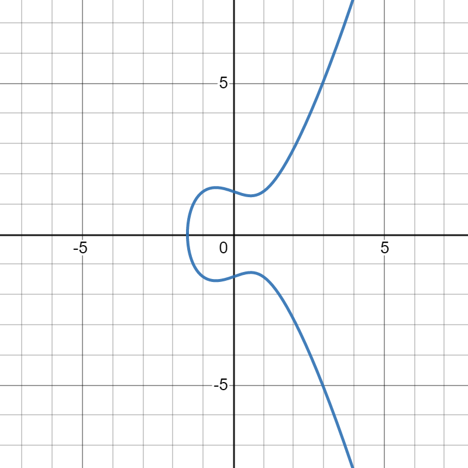
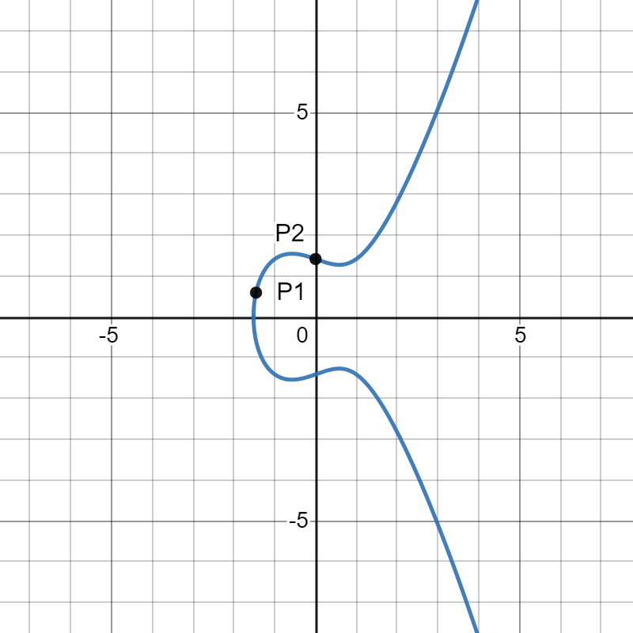
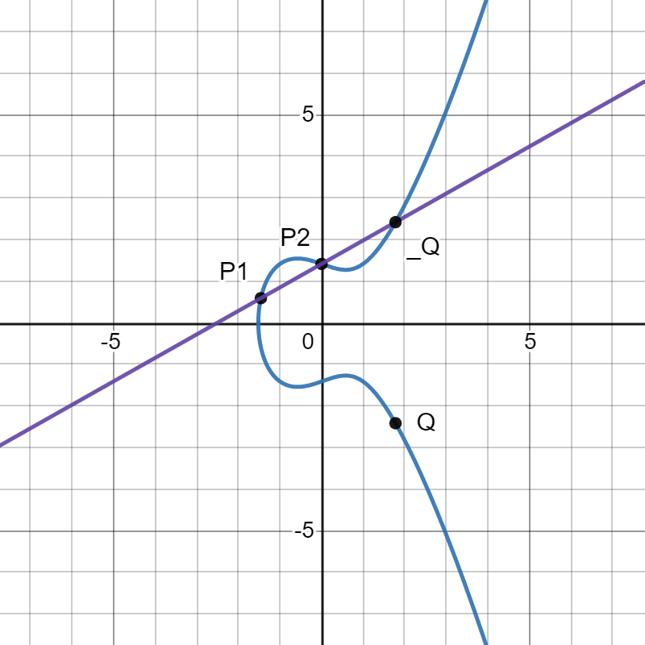
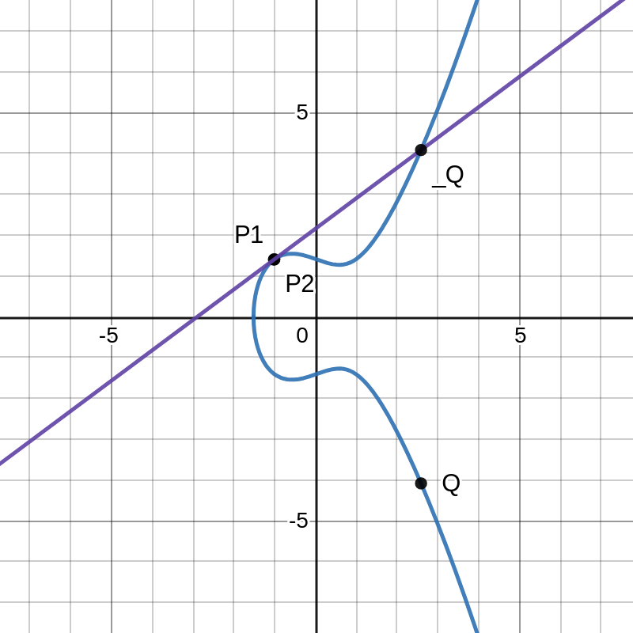

# UTCTF - Sleeves

**Category:** Crypto<br/>
**Points:** 990/1000<br/>
**Solves:** 34<br/>

&nbsp;

> I like putting numbers up my sleeves. To make sure I can fit a<br/>
> lot of them, I keep the numbers small.

&nbsp;

*Writeup By:* [gov](https://github.com/rgovind92)

&nbsp;

## TLDR
The RNG used in this challenge is a variation of Dual_EC_DRBG, an [infamous](https://en.wikipedia.org/wiki/Dual_EC_DRBG#Weakness:_a_potential_backdoor) RNG in which the NSA installed a backdoor and asked NIST to endorse. Find the backdoor, predict the next state, hash it, and decrypt the flag. If you already know what elliptic curves are, jump to the Solution.

&nbsp;

## Background
Elliptic curves are equations of the following form.

&nbsp;

<p align="center">
    
</p>

&nbsp;

where _a_ and _b_ are called curve parameters, as they define the shape of the curve. Here's what  (where _a_ is -1 and _b_ is 2) looks like:

&nbsp;



&nbsp;

If you remember math from high school, you may have heard of linear equations or straight lines (equations of the form ), and about how you can plug in values for _x_ and solve for _y_ to get a point (a pair of **_x_** and ***_y_*** coordinates) on a line. You can do the same thing for elliptic curves too: Here are two points _P1_ and _P2_ that lie on the curve we defined earlier:

&nbsp;



&nbsp;

Now, just like with numbers, we can add two points on an elliptic curve to get a third point. To add _P1_ and _P2_, first draw a straight line through them and find out where it intersects the curve (say, _\_Q_). Then draw a vertical line passing through see and find out where it meets the curve (say, _Q_). This point _Q_, is the the sum of _P1_ and _P2_, or in terms of an equation: _P1_ + _P2_ = _Q_. Here's a plot of the whole process (Note that I haven't drawn the vertical line, but you can imagine _Q_ as a "reflection" of _\_Q_ across the x-axis):

&nbsp;



&nbsp;

We can even add a point to itself! To do so, all we need to do is draw a tangent to the curve at the point we want to add, and repeat the previous process. This is process of adding a point to itself is also called scalar multiplication, and is analogous to scalar multiplication of integers: Just as _a_ + _a_ is equal to 2 . _a_, _P_ + _P_ = _Q_ is equivalent to 2 . _P_ = _Q_. Here's a picture:

&nbsp;



&nbsp;

Why is this relevant to crypto? Because the multiplication of a point _P_ on a curve by a scalar _n_ (or equivalently, adding _A_ to itself _n_ times) is a one-way function (a function that is hard to invert). Recall the traditional one-way function used in modern crypto, modular exponentiation:

&nbsp;

<p align="center">
    
</p>

&nbsp;

The problem of recovering _a_, given _b_, _g_, and _p_, is called the Discrete Log Problem, and this problem is what makes Diffie-Hellman Key Exchange and RSA difficult to break. As it turns out, the multiplication of a point on elliptic curves by a scalar is even harder, even for smaller numbers, making it a lot more efficient than modular exponentiation. Mathematically, the Elliptic Curve Discrete Log Problem (ECDLP) is the problem of recovering the unknown _n_ in the following equation:

&nbsp;

<p align="center">
    
</p>

&nbsp;

## Analysis
The RNG in this challenge is very similar to the Dual_EC_DRBG, and works by keeping track of an internal state, using this state as the scalar multiplier on one public point _P_ to generate the next state, and using this new state as a multiplier on another public point _Q_ to produce an output (whose 8 least significant bits are truncated). 

```
class RNG:
    def __init__(self):
        p = 115792089210356248762697446949407573530086143415290314195533631308867097853951
        b = 0x5ac635d8aa3a93e7b3ebbd55769886bc651d06b0cc53b0f63bce3c3e27d2604b

        self.curve = EllipticCurve(GF(p), [-3,b])
        self.P = self.curve.lift_x(110498562485703529190272711232043142138878635567672718436939544261168672750412)
        self.Q = self.curve.lift_x(67399507399944999831532913043433949950487143475898523797536613673733894036166)
        self.state = randint(1, 2**256)

    def next(self):
        sP = self.state*self.P
        r = Integer(sP[0])
        self.state = Integer((r*self.P)[0])
        rQ = r*self.Q
        return Integer(rQ[0])>>8
```

&nbsp;

There's a really good [post](https://crypto.stackexchange.com/questions/51532/does-the-backdoor-in-dual-ec-drbg-work-like-that#answer-51541) explaining the backdoor, and I'll just paraphrase it here. Assuming that _s<sub>i</sub>_ and _o<sub>i</sub>_ are the _i<sup>th</sup>_ states and outputs of the RNG, and that P<sub>x</sub> denotes the _x_ coordinate of the point _P_, then:

&nbsp;

<p align="center">
    
</p>
<p align="center">
    
</p>

&nbsp;

Recall that as per the addition law of elliptic curves that we saw earlier, there exists an integer _n_ such that _P = n . Q_, and we can thus rewrite _s<sub>i</sub>_ as follows:

&nbsp;

<p align="center">
    
</p>
<p align="center">
    
</p>
<p align="center">
    
</p>
<p align="center">
    
</p>

&nbsp;

Where I've just replaced  with _R_, a point whose _x-coordinate_ _R<sub>x</sub>_ is nothing but _o<sub>i</sub>_ with the truncated LSBs. Since the output is truncated only by 8 bits, we can loop through the 256 different combinations and get 256 candidates for _R_.

&nbsp;

## The Backdoor
This leaves us only with the one unknown: _n_. But who's to say that no one knows _n_? What if the three-letter agency that selected _P_ and _Q_ were sly enough to choose a _Q_ by simply multiplying _P_ with some _n_? By choosing an _n_ that is large enough, they could be assured that no one would ever find _n_ (because of the inherent difficulty of ECDLP), but at the same time they could publish the points _P_ and _Q_ as just random points on the curve, like that they had [nothing up their sleeves](https://en.wikipedia.org/wiki/Nothing-up-my-sleeve_number).

&nbsp;

## Solution
In this challenge though, _n_ is small. Try multiplying _Q_ by numbers between 1 and say, 256, and break if we find an _n_ such that . Once we know _n_, the predicting the next state (and thus, the next output) of the RNG should be straightforward. We know , which we know is the truncated version of _R_, so for each of the 256 candidates of _R_ we get a corresponding candidate for the next output. The hash of one of these will be the key that decrypts the flag.

```
for i in range(256):
    cand_state = (r2 << 8) + i
    try:
        poss_q = curve.lift_x(cand_state)
    except:
        continue
    cand_next = Integer((d * poss_q)[0])
    cand_next_output = str((Integer((cand_next * P)[0]) * Q)[0] >> 8)
    aes_key = SHA256.new(cand_next_output.encode('ascii')).digest()
    cipher = AES.new(aes_key, AES.MODE_ECB)
    dec = cipher.decrypt(bytes.fromhex(ct))
    if all([32 < a < 128 for a in dec]):
        print(dec)
        exit()
```

&nbsp;

### Flag: utflag{numbers_up_my_sl33v3_l0l}
