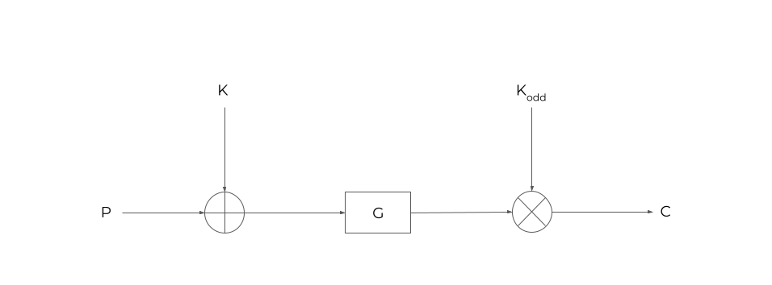
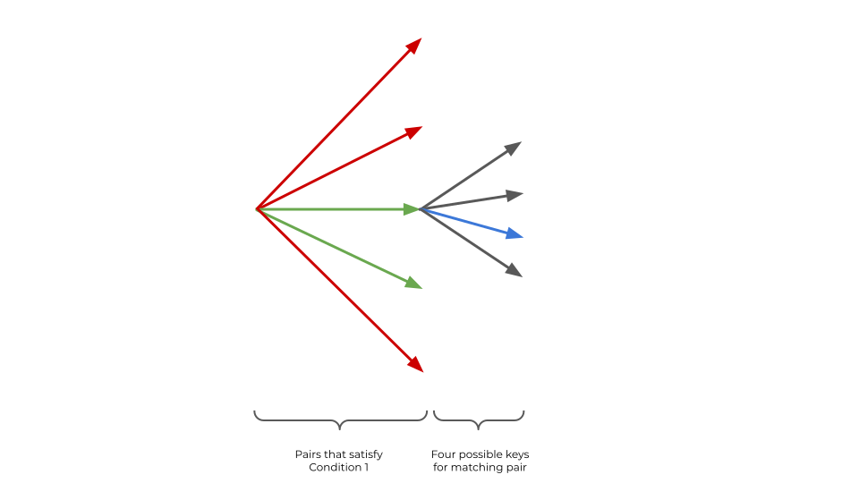

# picoCTF - Clouds

&nbsp;

**Category:** Crypto<br/>
**Points:** 500<br/>
**Solves:** 16<br/>

&nbsp;

> Cloud watching is a lot of fun! There are so many different
> shapes you see in them, and so many different types. They
> even inspired me to dig up an old cipher I once found to store
> notes about them. See if you can decrypt them! nc
> mercury.picoctf.net 10304 clouds.py
> The flag for this challenge does not include the standard
> picoCTF{} wrapper.

&nbsp;

*Write-up by:* [gov](https://github.com/rgovind92)

&nbsp;

## TLDR
Implement [this paper](https://link.springer.com/content/pdf/10.1007%2F3-540-45473-X_16.pdf). The rest of this write-up is basically a dumbed-down explanation of whatever I could understand in that paper.

&nbsp;

## Analysis
This challenge presents a note-taking program that allows us to encrypt upto 1024 notes and view them. We're also given an encrypted flag; Our task is to decrypt it. Here are the relevant encryption functions:

```
def pad(p):
        if len(p) % BLOCK_LEN != 0:
                return p + "\0" * (BLOCK_LEN - (len(p) % BLOCK_LEN))
        else:
                return p

def g(i):
        b = bin(i).lstrip("0b").rstrip("L").rjust(BLOCK_LEN * 8, "0")
        return int(b[::-1], 2)
        
def encrypt_block(b):
        k = open("./key").read().rstrip()
        assert (len(b) * ROUNDS) == len(k)
        result = int(binascii.hexlify(b), 16)
        for i in range(ROUNDS):
                key = int(binascii.hexlify(k[i * BLOCK_LEN:(i + 1) * BLOCK_LEN]), 16)
                key_odd = key | 1
                result ^= key
                result = g(result)
                result = (result * key_odd) % (1 << 64)
        return hex(result).lstrip("0x").rstrip("L").rjust(HEX_BLOCK_LEN, "0")

def encrypt(msg):
        plain = pad(msg)
        result = ""
        for i in range(0, len(plain), BLOCK_LEN):
                result += encrypt_block(plain[i:i + BLOCK_LEN])
        return result
```

&nbsp;

The cipher divides the plaintext into chunks of 8 bytes each, the 40-byte key into 5 subkeys, and applies five rounds of encryption to each block using each of the 5 subkeys. A round works as follows:
1. XOR the input with the subkey
2. Reverse the bits of the result (the _g_ function)
3. Multiply the result with an odd-version of the subkey (by forcing the LSB of the subkey to be 1)

Here's a diagram of the whole process:



&nbsp;

## Some Background
If you're not familiar with differential cryptanalysis, have a look at Jon King's excellent beginner-friendly [explanation](http://theamazingking.com/crypto-feal.php) of FEAL-4, the whipping boy of block ciphers. His implementation is in C, so if you're a noob like me, check out [this writeup](https://samvartaka.github.io/cryptanalysis/2016/04/08/volgactf-fiveblocks-writeup) by Jos Wetzels of an attack on a variation of FEAL-4 in Python.

&nbsp;

## The Challenge
So what makes this cipher different? Well, differential cryptanalysis relies on certain differentials propagating through operations of a round function. If these operations consist only of XORs, an attacker can supply pairs of inputs with a known fixed differential, look for statistical patterns in the output differential, and use these patterns to recover the key. However, in this cipher, there are two tricky operations - the bit reversal and the multiplication. The two of them work in tandem to scramble the bits (seemingly) well enough to block differentials from propagating, so to actually do any differential cryptanalysis, we need to come up with that one pair whose differential passes through both these operations.

&nbsp;

## A Breakthrough
After a bit of googling for the term "differential cryptanalysis multiplication", I stumbled upon [this paper](https://nikita.ca/papers/md.pdf), where the authors propose a framework to create differentials that survive multiplication. One of the examples in that paper is a summary of an attack on an old cipher called Nimbus (clouds?), initially devised by Vladimir Furman. A quick look at Nimbus's Wiki and Furman's [paper](https://link.springer.com/content/pdf/10.1007%2F3-540-45473-X_16.pdf) confirms that this cipher is indeed Nimbus!

&nbsp;

## Furman's Paper
After spending two days reading the paper, I realized that I was not smart enough to grasp all its algorithms (especially _Appendix A_), so I came up with a variation that's slightly less efficient (up to 18 bits of complexity vs Furman's 10), but easier to implement, so please bear with me. That said, here's a quick summary of some key concepts from the paper:

&nbsp;

## Lemma 1
For _n_-bit integers _A_ and _B_, each of whose LSBs is 0:

&nbsp;

<p align="center">
     
</p>

&nbsp;

The number in binary (zero followed by _n - 2_ ones and one zero, or 2<sup>n - 1</sup> - 2 in decimal) - let's call it Δ henceforth - is going to be the differential in this attack (There's also another differential mentioned in the paper, but we can do without it). Why this number in particular? Furman's first observation is that its binary representation is palindromic, which means reversing its bits has no effect on it (nullifying the _g_ function). So what this equation basically tells us is that, if the XOR of two _n-bit_ numbers _A_ and _B_ is Δ, then its sum is also Δ, and vice-versa.

&nbsp;

## Claim 1
Furman's second crucial observation about Δ is that for n-bit integers _A_, _B_, and _K<sup>odd</sup>_, the following equation holds with a probability of approximately 50%:

&nbsp;
<p align="center">
    
</p>

&nbsp;

## A One Round Iterative Characteristic
In the context of this cipher, the previous observation essentially means that the round function has "a one-round iterative characteristic", ie., we expect 50% of differentials to survive each round (with the other 50% discarded). In other words, if we were to pass 64 pairs of plaintexts, each with a differential of Δ, to the cipher, the number of ciphertexts with a differential of Δ after one round will on average be 32. This number decays to 16 after the second round, 8 after the third round, 4 after the fourth round, and 2 after the fifth round. Thus we expect that on average 2 ciphertexts will have a differential of Δ (and 60 without) after all five rounds of the cipher (The paper actually gives different numbers, but these were my observations with the plaintexts that I generated).

&nbsp;

## Recovering The Last Subkey
It follows from the one-round iterative characteristic that of the 4 pairs that had a difference of Δ after the fourth round, only two survived the fifth round. If we can find out which these two pairs were, we can then apply _Lemma 1_ and _Claim 1_ to recover the subkey of the fifth round. As it turns out, you can simply look at the bits and figure this out (have a look at _Condition 1_ in the paper):

```
def condition1(a, b):
    # 10 must be the LSBs of the XOR difference,
    # and 0 must be the LSB of each plaintext
    return (a ^ b) % 4 == 2 and a % 2 == 0 and b % 2 == 0
```

&nbsp;

Now, consider a pair of ciphertexts _C1_ and _C2_ with a difference of Δ after 5 rounds. Then, if _K<sup>odd</sup>_ is the subkey of round 5, and _A_ and _B_ are the values that go into the final operation of round 5:

&nbsp;

<p align="center">
    
</p>
<p align="center">
    
</p>

&nbsp;

Summing these two equations, we get:

&nbsp;

<p align="center">
    
</p>

&nbsp;

However, by the one-round iterative characteristic, we know that there are at least two such pairs of _A_ and _B_ that have a difference of Δ after the fourth round, and both these pairs will be in the list of pairs we created using ```condition1```. This means that, by _Lemma 1_, _A_ + _B_ = _A_ ⊕ B = Δ, and we can rewrite the previous equation as:

&nbsp;

<p align="center">
    
</p>

&nbsp;

We know _C1_, _C2_, and Δ, and can solve for _K<sup>odd</sup>_. Unless we're unlucky and had less than two ciphertexts with a difference of Δ after five rounds, there should be at least 2 pairs of _C1_ and _C2_ in our list of candidate pairs that will return the same _K<sup>odd</sup>_ value, and we expect this to be the subkey of the fourth round:

```
def find_subkeys(ciphertexts):
    subkeys = []

    for pair in ciphertexts:
        if condition1(pair[0], pair[1]):
            s = pair[0] + pair[1]
            if s % 2 == 0:
                subkeys.append((inv * s % word_size) // 2 % word_size)

    most_common_subkey = max(set(subkeys), key=subkeys.count)

    # Return 4 subkeys, one flipped MSBs and LSBs
    return (most_common_subkey, most_common_subkey ^ 2 ** 63,
            most_common_subkey ^ 1, most_common_subkey ^ 2 ** 63 ^ 1)
```

&nbsp;

Note that we do not know the MSB or LSB of the key, so we return 4 possible combinations with flipped MSBs and LSBs. For each of these 4 possible key combinations, we can then reverse the round function to get a list of candidate inputs to the fifth round function:

```
def partially_decrypt(ciphertext, subkey):
    plaintext = ciphertext * inverse(subkey, word_size) % word_size
    plaintext = g(plaintext)
    return plaintext ^ subkey
```

&nbsp;

Here are some arrows summarizing what we've done so far:



Starting from the left, the red and green arrows denote all the ciphertext pairs that satisfy _Condition 1_ (Here there are 5 pairs, but in practice, the number is usually a lot more). By the one-round iterative characteristic, we know that there are two pairs on average amongst these 5 that do have a differential of Δ, and so these two pairs (the green arrows) return the same value for _K<sup>odd</sup>_. We don't care about the other pairs (the red arrows), so we discard them. For one of the matching pairs, we get four possible subkeys (because we don't know the MSBs and LSBs), of which only one is correct (the blue arrow). But there's no way of knowing which is the correct one right, so we've reached a dead end.

&nbsp;

## Recovering The Remaining Subkeys (Workaround)
At this point, Furman directs us to _Appendix A_ to efficiently recover the previous subkeys. I'm still trying to understand _Appendix A_, but in the meantime, let's use a method that is a lot less efficient and a lot more harebrained. First, observe that not every candidate input pair to the fifth round (that we found out in the previous step) will have a sufficient number of pairs with difference of Δ. By the one-round iterative characteristic of this cipher, we can rule out a large number of these pairs that don't have sufficient Δ differentials. To be more concrete, assuming that we had 2 pairs with a difference of Δ after five rounds, we expect that each of the candidate pairs (which is basically the input to the fifth round) will have around 4 pairs on average with a difference of Δ. Thus, we can safely discard all sets that have, say, only 2 pairs with a difference of Δ. Similarly, we'd expect this number to be (around) 8 after the third round, 16 after the second round, and 32 after the first round. here's the function to filter out the list of pairs:

```
def _filter(arr, minimum):
    return [a for a in arr
            if len([b for b in a
                    if b[0] ^ b[1] == diff]) > minimum + 1]
```

&nbsp;

Now that we've trimmed the partially decrypted values down to a manageable size, we can just call ```find_subkeys``` again, except this time we pass it the partially decrypted values instead of the ciphertexts. For each of these pairs, we get four subkeys, and for each of these subkeys we ```partially decrypt``` to create the next set of partially decrypted values (that will be the input to the previous round), and ```_filter``` them again. After we repeat this process four times (for each of the remaining rounds), we'll have a set of candidate subkey values. One combination out of these candidates is the actual key.

```
def crack_round(partially_decrypted):
    subkey1, subkey2, subkey3, subkey4 = find_subkeys(partially_decrypted)
    next_partially_decrypted1 = [(partially_decrypt(a[0], subkey1),
                                  partially_decrypt(a[1], subkey1))
                                  for a in partially_decrypted]
    next_partially_decrypted2 = [(partially_decrypt(a[0], subkey2),
                                  partially_decrypt(a[1], subkey2))
                                  for a in partially_decrypted]
    next_partially_decrypted3 = [(a ^ 1, b ^ 1)
                                 for a, b in next_partially_decrypted1]
    next_partially_decrypted4 = [(a ^ 1, b ^ 1)
                                 for a, b in next_partially_decrypted2]
    return ([next_partially_decrypted1, next_partially_decrypted2,
            next_partially_decrypted3, next_partially_decrypted4],
            [subkey1, subkey2, subkey3, subkey4])
```

&nbsp;

To actually carry out the attack, we'll need to first create 64 pairs of plaintexts that differ by Δ by combining two of what Furman calls Δ-structures, ensuring that these two structures differ only in their MSBs (Have a look at the paper for further information on creating these Δ-structures). We ask to encrypt these Δ-structures, and then carry out the process described above.

Now, at this point, you might think that my algorithm doesn't run in polynomial time, and you're right. In the context of the picture with arrows, all I'm doing is drawing green and red arrows out of each blue and blue arrow recursively four times. But because we ```_filter``` out values after each round, the number of combinations is fairly manageable, and so the algorithm isn't quite exponential.

Because of the probabilistic nature of the attack, depending on the plaintexts we generate, we might end up with either zero combinations or way too many combinations. In my implementation I just ensure that the number of possible combinations is less than 18 bits (because my CPU makes strange noises when I try to brute-force anything above that); If it isn't, I must have generated "bad" plaintexts, so I repeat the process again, this time hoping for "good" ones. If you do the math, you'll find that there's a 50% chance that the algorithm works on its first try (and a 0.2% chance that it doesn't work at all, due to the limit of 1024 encryptions per session). In other words, if you're slightly lucky, you'll recover the key on the first attempt, and if you're _extremely_ unlucky, the worst that could happen is that you'll have to run the script again.

&nbsp;

### Flag: f2c94f57b1cb1988138d17ab388b5cc5
