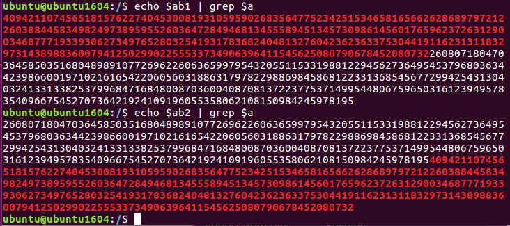
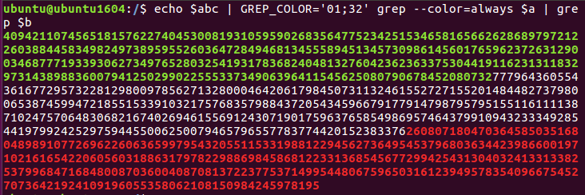

# picoCTF - Scrambled: RSA

Category: Crypto<br/>
Points: 140<br/>
Solves: 99<br/>

&nbsp;

> Hmmm I wonder if you have learned your lesson... Let's
> see if you understand RSA and how the encryption works.
> Connect with nc mercury.picoctf.net 58251.

&nbsp;

Writeup By: [gov](https://github.com/rgovind92)

&nbsp;

## The Challenge
I'm not sure this is the intended solution, because unlike what the challenge description says, you can solve this without even knowing what RSA is! Anyways, the challenge outputs an encrypted flag, the public modulus (_n_), and the public key (_e_):

```shell
flag: 28315151787008598750687445077442851362791798365048726230007170614101899067117809164915398889257586247956120320014983903400140999421663002320526698293882339815210250335591733160427121280077807383100999806350316884521912476585713474827809008092695191961046756573246908378050587928394291726918574673035527321260633459454226991432691659768856692704980125119535151239915829378779742185739049174553910835858239410986095990681058121001203059741870312665897740641711256035827227253583216672557018837549826986073903528154166505131594535146746554800122162859398224401260178127872044181322144854695400542704420069859850487225331861366145200584863138918931827620047257621827804068666629110025721044463718700399275492237784188100021285877866265405769681300795135778018205308070923146232395272408019644957971476409983064311007589674015268353784821801757516183283055718778105869282342637976007957628976372026670000857370434308330910199963337760849596334649296002223074431520307429075906382098129795125950241265007441113641315561291189011104781603671953028894932092605129646146846961106348962187760492627333801809318540318737046933261821486453904123971518070614396334753660033560884161771608208359773691298584582451183396854683074425582684190892338916825658524274432483782501395809323036773969400350672746607201861867262126796185422352077775531497387390737440578002377077669691022636392249516592295632199130210150963075315553208935973489390323383116619459292916553520190539592554589330684718690104042311498280385237185666676780298535277787630044219192278275938202263148249221169267389164261713850234145076136745540674666772639404216632685550818928903741884084777057023037862651810561604204108189218559460855883074254650007533138343255722808848497824125434466854455673369836839277400330295207510157877431833129166850683284740327745126286997052040851003206595907902839669480241955460077316736800778150704487989717609101061129372477117770513059814142468317793167065475383597567849460886695097745545445009346990116778570472309641149173141170734261352705950023195248530353743584365661126079636075020996860005610323858070781408512632269693423949171202831636767980777893058132259441999940105340113069860487248289451151506725131217640637961022193724152104563992581454074517689093414131854420863359506949118553334913672638820941107187334027997972024423301132882622638701163793683065937602213977763900287532673848828742790122129097178704038180537045677230042454866880647323392914235144670016889533181658835781939778557605353280837224062520450227833827951141963402051082039438633752041979213712971409689947413590338049614367506580292389810657475850362961598322067141709598240999122644754149663751563857565713494946925047803894575568205635691091789755247672417574660003922923141913571457025599775456832333775821771747432225029156888069793327315119264056226589604050753070712823272112157335541927236706867836307548744545895048293143188421248645176376785868847157806871282350142733685014418606535676238424790588133783692452328284286093343800015355885443087088336404535545138098508535890566582009522696026979285087569899388988378917061919565428906331852621070471126473338952383558957931232206087664526240767903379664457714565612274605076700541061849666988061794731550591037884601952809849667211755220404121883470336116625658436233462639447986880264618227128865992979683588772296172086663675899740532371015585939946215545410239792471003380462619230467602845607946726966938585973321069157880236223174145064423406377729481789750614349618442318641490704871692139010312995307104668187332008707451215639905326238589186841418817783414277110274921452486711675364416448735429025185583482650194218107976124865241999414925528070485432663312002925373108730627097184404510036308090848324690625522842470554672882241548936568892642120312169569623178017144960837505220015624961373603743376322326011482155289717500682731136847573359738323038443138408761419052262122431524654312618804650020744723221035143611753663416720550740176946623832626826912292107891195252043991107656016433831429289037402597658774490901505537976013276890255984396669632170873861129405310940026586624181122290511583019875170616211381547265986141090509235331035903144401932021905946333372178479991626097934930763979934008845401617427241357519162538995606535603291560668328789526751449200958720885848029863128098881538282142947749861628590132600495286510385606025591022348350709501506113211378454335094157297212236005016301858303389319926911846712385755207904631721870789566161259455020235911037181955120522616980740119657859315434581581561313601666986952688827716321757523653456373432912392082865330939156636442837652607857284157027629160761782762957634077959574579759169582226595774062991294698062525542206714050610996543481048736395511094157190276258074046498121268104623205114196166495292873026466748082180602404452805453368610816177193915533327792653932757072904300816572813267215862634357271632494931803035001299291549115713155202713393201389906848183577643552517736221039308355047092469167602344373816284675621745578615989206184255999054175750288932269482734784844197859950006715709852344766295712444007467074437421084501252907250560955169296982495110937546344904634598159023506331924481511052734197143977522963891379222278344549217726508473264203246636048584882133814170019219876209734327435139332684645877478287647804923286453283893430582982004103932797997660568399830267262073673782213873867772948200059007347547297439047349472137254241344976067077535516442446528063941332709050054775557131346484789616409773587544854536993878477626200116471534442106947379984329838933991344379484063066908262435277802973591374213196479296888869035867997327619581392353254835364525231777474484741550857338782536288774057677750847461150798766481600411623009394543474576073391227643847351607687366464991276050119948410155853275944699239693833020455590986778542731732198463005793598787202319233706824946483124369986216429125009948154334631007389791202811257434088413302438685088006142419631274670210241549520949809191896837356477895782410377802668284086076435945811726291593906681654897694956927638448187727363155355902134652619141372572571575928632037439609108270948427196340328904287809562075468853168670462858504900447427220006665878829765418141312787599868902995064606390573284710543466758292142991301875602116527469550418388723388780008031734179347845995380501061883960246738547535866745877025286926539457313057558020589060079178782880744350700016369910862599544390457179817385870492187639677092413698428412300382867431050078651821960700731549377105620269001457487893704752815496493948111223306223606499791440954825274586638674578806680503566451674383092335514999345822328202201553026808822684707933715792303361270098823155812819264517820288884832042452078166416100763571626705713763792177819549443244121487177292686625652875925985669455118830419523775358977705501989094577802404870569712264699226354802837852886473687714531776470505001323702631174105481560227062559370520032907223894241054051059010606917474244718620101098957343220408300994489766516083037844728191124472728220507067335078402490815740388322980187470309845253387874472256852898945675088332800058605246441647662072058496723155997184093031112885121426796923145316236879662590734878555281274033366430941086259961765924881486487709890488665817060558751120769270364079500431552772874536471158757125180440589248581803342502616876843222473482310762516840587254130119787671884305989741496874077556382767069249737687894497090455104737145183232880589687533401388371083418328931909405393874184444672159800786950563224137142799136822913799390067117319888134620805293232024585745344569725209931542502851864969693787442069029087716930523601265286587957732573642144274281269935281660280916057244257570258810677891817286311320001844282557101896876286556566592244848865462956986803538523095613494145829230925895792336521980802165290290853721478950778521734076141412617199062984817785804246360502372801065393040671997252513485489214261359
n: 109059791533701839999920936924165762910278956109176088031746418764170331535776995785902019573851759143108105564893100481695282738073366355987377256501385010008687082509127329540304289751799057590609315843312452176659272587409303709237283386795811695919013595780935186118673359897728308201820456043410178338519
e: 65537
```

&nbsp;

## Analysis

Recall that in the RSA cryptosystem, the ciphertext _c_, plaintext _m_, public key _e_, and modulus _n_ are related as follows:

&nbsp;

<p align="center">
    
</p>

&nbsp;

Right away, we see that the ciphertext here (_flag_) is much bigger than _n_, so this might not be conventional RSA (Perhaps each character is encrypted separately and then concatenated?). Just to verify that this isn't textbook RSA, where a 0 is encrypted as 0, and a 1 as 1, let's try passing in them in:

```shell
(echo -e '\x00\n\x01' && cat) | nc mercury.picoctf.net 58251
...
I will encrypt whatever you give me: Here you go: 23719065906383464698822759154616073166018849575700194812036963072733126052408028882800107849334040979312191136088187843811208444469870514378562196578983797163482686387444770018601754161145896200449364187322830660020617085746229240461646927858024168380027534087435702909076384773238780326119726429037261937865
I will encrypt whatever you give me: Here you go: 35138504912504660554287236019089210647852486746476950741554907362158616509890278628386376351841802001726371025769791259829501072372506490805314919327300264265275274027405818267858313757379015370751314477275064187089228080296052702134906007289922671291060395005837336451554639554253139737154189707073081598402
```

&nbsp;

Looking at those outputs, it seems that input might be padded. But let's forget that this has anything to do with RSA for moment, and send some stings, say 'a' once and 'ab' twice:

```shell
I will encrypt whatever you give me: a
Here you go: 40942110745651815762274045300819310595902683564775234251534658165662628689797212260388445834982497389595526036472849468134555894513457309861456017659623726312900346877719339306273497652803254193178368240481327604236236337530441911623131183297314389883600794125029902255533734906396411545625080790678452080732
I will encrypt whatever you give me: ab
Here you go: 4094211074565181576227404530081931059590268356477523425153465816566262868979721226038844583498249738959552603647284946813455589451345730986145601765962372631290034687771933930627349765280325419317836824048132760423623633753044191162313118329731438988360079412502990225553373490639641154562508079067845208073226080718047036458503516804898910772696226063659979543205511533198812294562736495453796803634423986600197102161654220605603188631797822988698458681223313685456772994254313040324133133825379968471684800870360040870813722377537149954480675965031612394957835409667545270736421924109196055358062108150984245978195
I will encrypt whatever you give me: ab
Here you go: 2608071804703645850351680489891077269622606365997954320551153319881229456273649545379680363442398660019710216165422060560318863179782298869845868122331368545677299425431304032413313382537996847168480087036004087081372237753714995448067596503161239495783540966754527073642192410919605535806210815098424597819540942110745651815762274045300819310595902683564775234251534658165662628689797212260388445834982497389595526036472849468134555894513457309861456017659623726312900346877719339306273497652803254193178368240481327604236236337530441911623131183297314389883600794125029902255533734906396411545625080790678452080732
```

&nbsp;

Because the cipher does not appear to be deterministic ('ab' has more than one ciphertext), let's use _E_ to denote the encryption function, and _E<sub>i</sub>(P)_ to denote the _i<sup>th</sup>_ ciphertext of a plaintext _P_. If you play around with this for a while, you'll notice that the maximum value of _i_ is equal to the length of the plaintext. In other words, a plaintext of length 1 will always return the same ciphertext, a plaintext of length 2 will randomly return one of two ciphertexts, and so on.

Also note that _E<sub>1</sub>('ab')_ is almost twice as long as _E<sub>1</sub>('a')_, which suggests that there might be some concatenation going on. In fact, if you stare at those numbers long enough, you'll realize that _E<sub>1</sub>('a')_ is in both _E<sub>1</sub>('ab')_ and _E<sub>2</sub>('ab')_.

```shell
ubuntu@ubuntu1604:/$ a=40942110745651815762274045300819310595902683564775234251534658165662628689797212260388445834982497389595526036472849468134555894513457309861456017659623726312900346877719339306273497652803254193178368240481327604236236337530441911623131183297314389883600794125029902255533734906396411545625080790678452080732

ubuntu@ubuntu1604:/$ ab1=4094211074565181576227404530081931059590268356477523425153465816566262868979721226038844583498249738959552603647284946813455589451345730986145601765962372631290034687771933930627349765280325419317836824048132760423623633753044191162313118329731438988360079412502990225553373490639641154562508079067845208073226080718047036458503516804898910772696226063659979543205511533198812294562736495453796803634423986600197102161654220605603188631797822988698458681223313685456772994254313040324133133825379968471684800870360040870813722377537149954480675965031612394957835409667545270736421924109196055358062108150984245978195

ubuntu@ubuntu1604:/$ ab2=2608071804703645850351680489891077269622606365997954320551153319881229456273649545379680363442398660019710216165422060560318863179782298869845868122331368545677299425431304032413313382537996847168480087036004087081372237753714995448067596503161239495783540966754527073642192410919605535806210815098424597819540942110745651815762274045300819310595902683564775234251534658165662628689797212260388445834982497389595526036472849468134555894513457309861456017659623726312900346877719339306273497652803254193178368240481327604236236337530441911623131183297314389883600794125029902255533734906396411545625080790678452080732
```

&nbsp;



&nbsp;

Looking at that output, we can assume that portion not in red is somehow related to _E<sub>1</sub>('b')_ (it isn't exactly _E<sub>1</sub>('b')_; You can verify this by asking the oracle to encrypt 'b'). Here's what you get when you encrypt 'abc':

```shell
I will encrypt whatever you give me: abc
Here you go: 409421107456518157622740453008193105959026835647752342515346581656626286897972122603884458349824973895955260364728494681345558945134573098614560176596237263129003468777193393062734976528032541931783682404813276042362363375304419116231311832973143898836007941250299022555337349063964115456250807906784520807327779643605543616772957322812980097856271328000464206179845073113246155272715520148448273798006538745994721855153391032175768357988437205434596679177914798795795155116111138710247570648306821674026946155691243071901759637658549869574643799109432333492854419799242529759445500625007946579655778377442015238337626080718047036458503516804898910772696226063659979543205511533198812294562736495453796803634423986600197102161654220605603188631797822988698458681223313685456772994254313040324133133825379968471684800870360040870813722377537149954480675965031612394957835409667545270736421924109196055358062108150984245978195

ubuntu@ubuntu1604:/$ b=26080718047036458503516804898910772696226063659979543205511533198812294562736495453796803634423986600197102161654220605603188631797822988698458681223313685456772994254313040324133133825379968471684800870360040870813722377537149954480675965031612394957835409667545270736421924109196055358062108150984245978195

ubuntu@ubuntu1604:/$ abc=409421107456518157622740453008193105959026835647752342515346581656626286897972122603884458349824973895955260364728494681345558945134573098614560176596237263129003468777193393062734976528032541931783682404813276042362363375304419116231311832973143898836007941250299022555337349063964115456250807906784520807327779643605543616772957322812980097856271328000464206179845073113246155272715520148448273798006538745994721855153391032175768357988437205434596679177914798795795155116111138710247570648306821674026946155691243071901759637658549869574643799109432333492854419799242529759445500625007946579655778377442015238337626080718047036458503516804898910772696226063659979543205511533198812294562736495453796803634423986600197102161654220605603188631797822988698458681223313685456772994254313040324133133825379968471684800870360040870813722377537149954480675965031612394957835409667545270736421924109196055358062108150984245978195
```

&nbsp;



&nbsp;

What this means is that _E<sub>1</sub>('a')_ and (some value related to) _E<sub>1</sub>('b')_ is always in all of _E<sub>i</sub>('abc')_. This applies to _E<sub>1</sub>(flag)_ as well: If we were to encrypt 'pi' (because those are the first two characters of the flag format), we'll find that _E<sub>1</sub>('p')_ will always be in _E<sub>1</sub>(flag)_, and so will (some value related to) _E<sub>1</sub>('i')_. On the other hand, if we were to encrypt 'pj', we'll find that (some value related to) _E<sub>1</sub>('j')_ is not in _E<sub>1</sub>(flag)_. You can see where this is going.

&nbsp;

## Solution

1. Create a string _known_ of known characters.
2. Ask to encrypt 'p', verify that _E<sub>1</sub>('p')_ is in _E<sub>1</sub>(flag)_, and append  'p' to _known_.
3. Loop over all printable characters, and for each printable character _c_, ask to encrypt _known_ + _c_.
3. Extract (some value related to) _E<sub>1</sub>(c)_ from the ciphertext and check if that value is in _E<sub>1</sub>(flag)_.
4. If it is, break out out of the loop and append _c_ to _known_. If _c_ happens to be '}', print _known_ and exit; Otherwise go to step 2.
5. If it isn't, continue to the next character.

&nbsp;

### Flag: picoCTF{bad_1d3a5_1314164}
